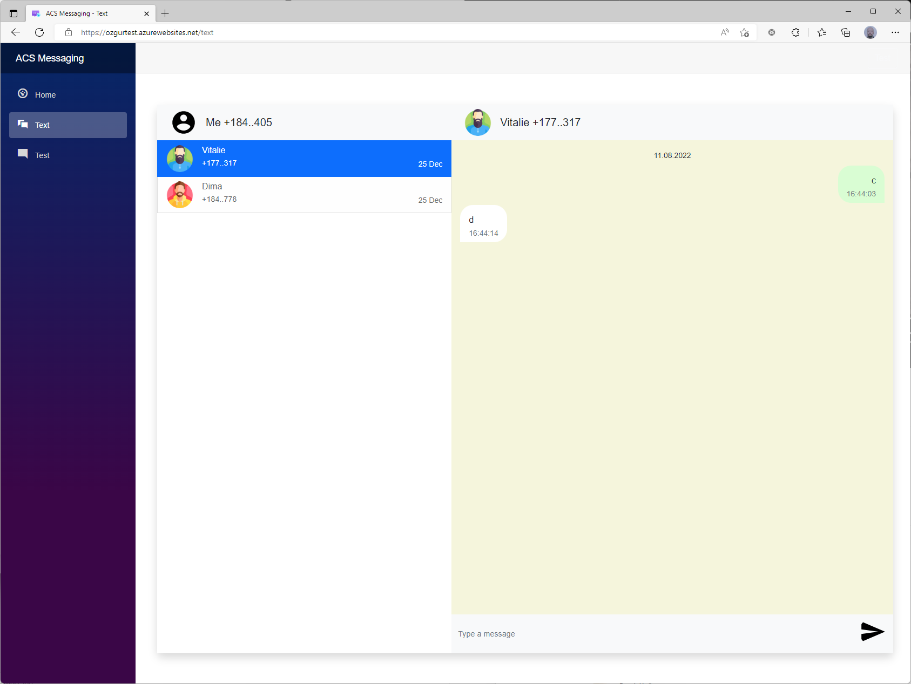

[](https://ozgurtest.azurewebsites.net/)

# Azure Communication Services SMS Messaging Sample

A demonstration of Azure Communication Services SMS & Phone numbers capabilities in a Blazor app.



## Features

- **Blazor** sample for ACS.
- **Open source** conversation UI.

## Prerequisites

- An Azure account with an active subscription. [Create an account for free](https://azure.microsoft.com/free/).
- An active Azure Communication Services resource. [Create a Communication Services resource](https://docs.microsoft.com/azure/communication-services/quickstarts/create-communication-resource).
- .NET 6 SDK [Download](https://dotnet.microsoft.com/download/dotnet/6.0)

## Code Structure

- .../Client: Frontend client app.
- .../Server: Backend app.
- .../Shared: Shared code between Client and Server.
- /Deploy: Docker file for Azure deployment.
- .../Server/appsettings.json: Configuration file where to write connection string for ACS.

## Running the app locally

> PS: You can send SMS locally, but to receive SMS it should be published on Azure.

- Edit configuration
```json
"Acs": {
	"ConnectionString": "endpoint=https://********.communication.azure.com/;accesskey=**************"
}
```
- `dotnet run`

## References

- [ACS - Receive SMS with Azure Event Grid](https://docs.microsoft.com/en-us/azure/communication-services/quickstarts/sms/handle-sms-events)
- [ACS - Get phone numbers](https://docs.microsoft.com/en-us/azure/communication-services/quickstarts/telephony/get-phone-number?tabs=windows&pivots=programming-language-csharp)

## Trademark

**Trademarks** This project may contain trademarks or logos for projects, products, or services. Authorized use of Microsoft trademarks or logos is subject to and must follow [Microsoft's Trademark & Brand Guidelines](https://www.microsoft.com/legal/intellectualproperty/trademarks/usage/general). Use of Microsoft trademarks or logos in modified versions of this project must not cause confusion or imply Microsoft sponsorship. Any use of third-party trademarks or logos are subject to those third-party's policies.

## License

[MIT](LICENSE.md)